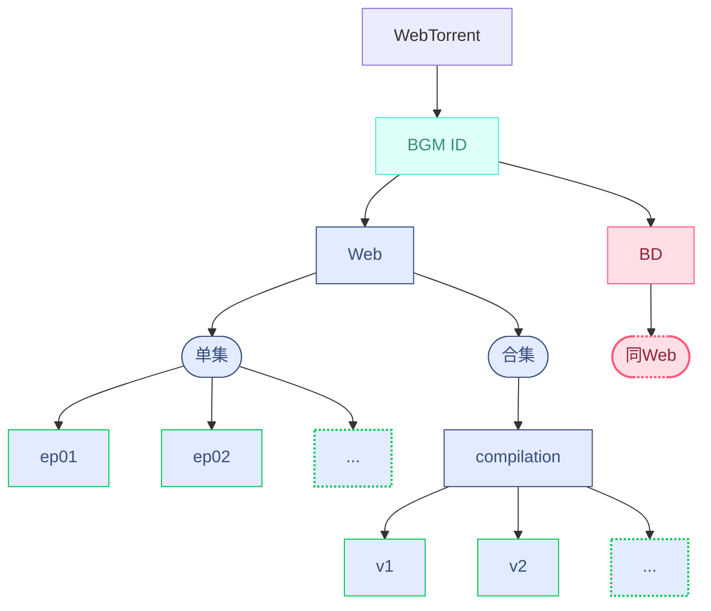

本项目目前仅用于 Web Torrent 链接跳转

**但经过测试，qbit无法识别html中重定向后的文件，目前此项目无用**

### Web Torrent
Web Torrent 是用 HTTP 加速 BT 下载，存在链接失效的可能性，且已发布的种子难以修改，所以使用本项目作为链接的跳转

#### 文件结构

```mermaid
flowchart TB
    n1["WebTorrent<br>"] --> n2["BGM ID"]
    n2 --> n3["Web"] & n4["BD"]
    n3 --> n5(["单集"]) & n6(["合集"])
    n5 --> n9["ep01"] & n10["ep02"] & n11["..."]
    n6 --> n12["compilation"]
    n12 --> n13["v1"] & n14["v2"] & n15["..."]
    n4 --> n16(["同Web"])

     n3:::Web
     n4:::DB
     n5:::Web
     n6:::Web
     n9:::WebFile
     n10:::WebFile
     n11:::WebFile
     n12:::Web
     n13:::WebFile
     n14:::WebFile
     n15:::WebFile
     n16:::DB
    classDef Web stroke-width:1px, stroke-dasharray:none, stroke:#374D7C, fill:#E2EBFF, color:#374D7C
    classDef WebFile stroke-width:1px, stroke-dasharray:none, stroke:#374D7C, fill:#E2EBFF, color:#374D7C, stroke:#00C853
    classDef DB stroke-width:1px, stroke-dasharray:none, stroke:#FF5978, fill:#FFDFE5, color:#8E2236
    style n2 stroke-width:1px, stroke-dasharray:none, stroke:#46EDC8, fill:#DEFFF8, color:#378E7A
    style n11 stroke-width:2px,stroke-dasharray: 2
    style n15 stroke-width:2px,stroke-dasharray: 2
    style n16 stroke-width:2px,stroke-dasharray: 2
```
